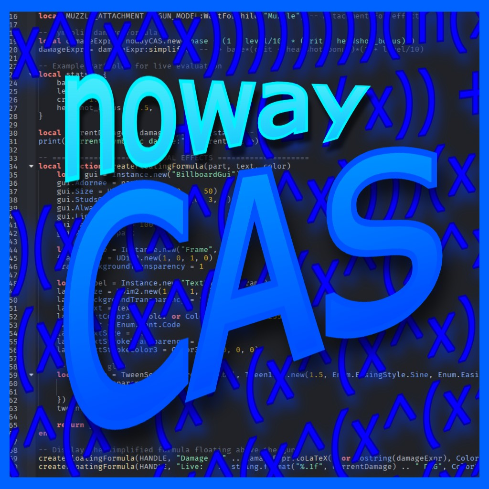
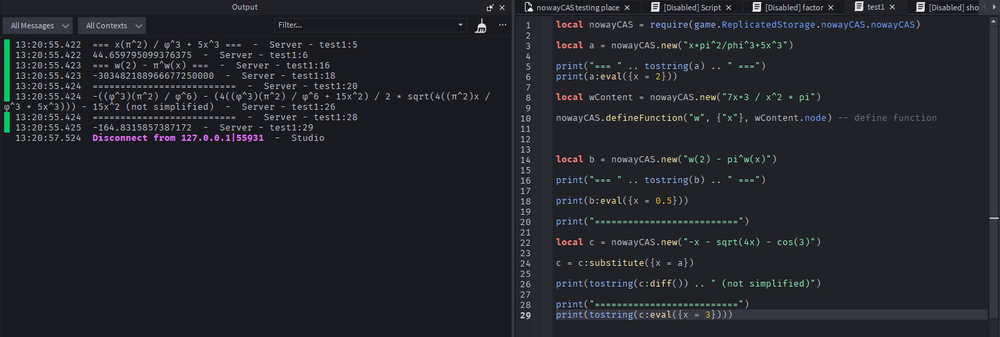

<p align="center"> 
     
</p>

<h1 align="center">nowayCAS</h1>

<p align="center">
    <strong>A full-featured Symbolic Computer Algebra System for Luau & Roblox Studio</strong> 🔥🧮
</p>

## Why nowayCAS?
Roblox's built-in math is purely **numerical** - great for games, but useless for symbolic manipulation.

You can't natively:
- Parse `"3x + pi^7"` and keep it exact
- Simplify `(x^2 - y^2)/(x - y)` → `x + y` (beta)
- Substituting expressions with values and other expressions
- Evaluate reciprocal functions (csc, sec, cot) and inverse hyperbolic functions
- Differentiate, factor, or rewrite expressions symbolically

But if you really had to, you need to use `loadstring()` enabled,
- Which makes your game vulnerable.
- and it can't do algebra.

Or you can use other modules in the Roblox community but some (to put it nicely):
- Can not parse algebra through strings like "sin(x)^2 + y^3 - sqrt(5)"
- Can not simplify expressions
- Can not freely put any kind of expression you'd like in any form

**nowayCAS changes everything.**

<p align="center">
    
</p>

## Features 🚀

nowayCAS is a **full-featured symbolic engine** built from the ground up in pure Luau:

- **Expression parsing** from strings → optimized **AST → DAG** representation (shared subexpressions for speed & memory)
- **Natural math syntax** via operator overloading (`x^2 + 2*x + 1`)
- **Equation support** as two expressions and one relation which can be manipulated.
- **Symbolic manipulation**:
  - Assumption system (x is positive, negative, etc) with assigning, removing, and checking.
  - Simplification (algebraic identities, rational forms) integrated with assumptions
  - Expansion & factoring of polynomials (partially)
  - Symbolic **differentiation** (`var:diff()`)
  - Variable/expression **substitution** (`:substitute({x: AST_node = 3})`)
- **Evaluation**: Numerical results with parameter tables (`:eval({x=5})`)
- **Extensibility**:
  - Built-in functions & constants (sin, cos, pi, tau, etc.)
  - **User-defined functions and constants**
- **Output formats**:
  - `.toString()` → clean pretty-printed Unicode
  - `.toLaTeX()` → ready for docs/export
  - `.toDAGString()` & `.toASTRepresentation()` → debugging/power-user tools
- **Modular design** → easy to extend with new rules, parsers, or backends

All of this runs natively in Roblox Studio - no external services needed.

## How to Use?
nowayCAS exposes a simple, expressive external API for parsing, manipulating, differentiating, simplifying, evaluating, and printing symbolic expressions. Everything begins with `nowayCAS.new(...)`, which parses a string into an immutable expression tree.


### 1. Parsing Expressions

```lua
-- Parse a string into an immutable expression tree
local expr = nowayCAS.new("2x^2 + 3x - 5")

print(expr)                 --> 2x^2 + 3x - 5
print(expr:toLatex())       --> 2x^{2} + 3x - 5
print(expr:toDAGString())   --> DAG-style structural print

```

### 2. Simplification, Expansion, Factorisation

```lua
local e = nowayCAS.new("(x + 2)(x - 2)")

print(e:expand())           --> x^2 - 4
print(e:factor())           --> (x - 2)(x + 2)

local e2 = nowayCAS.new("43x + 54x - (8 + 3)")
print(e2:simplify())         --> 97x - 11
```


### 3. Differentiation

```lua
local f = nowayCAS.new("3x^3 - 4x + 7")

local df = f:diff("x")
local df2 = f:diffN("x", 2)
print(df)                   --> 9x^2 - 4
print(df:toLatex())         --> 9x^{2} - 4
print(df2)					        --> 18x
```

### 4. Substitution

```lua
local g = nowayCAS.new("x^2 + y")

-- Substitute x = 3, y = 10
local substituted = g:substitute({
	x = nowayCAS.new("3").node,
	y = nowayCAS.new("10").node,
})

print(substituted)              --> 3^2 + 10
print(substituted:simplify())   --> 19
```


### 5. Evaluation

```lua
local h = nowayCAS.new("2x + 3y")

local value = h:eval({
	x = 4,
	y = math.pi,
})

print(value)                    --> 2*4 + 3*pi
```


### 6. Raw AST API (optional)

```lua
local ast = nowayCAS.new("x^3 + 1").node

print(nowayCAS.toString(nowayCAS.diff(ast, "x")))
print(nowayCAS.toLatex(nowayCAS.simplify(ast)))
print(nowayCAS.toDAGString(nowayCAS.expand(ast)))
```


### 7. User-Defined Functions

```lua
-- Define f(x, y) = (2*(3y + 7x)) / 3
nowayCAS.defineFunction(
	"f",
	{ "x", "y" },
	nowayCAS.new("(2*(3y + 7x)) / 3").node
)

local call = nowayCAS.new("f(7, 4) - 40")
print(call:eval())
print(call)
```


### 8. User-Defined Constants

```lua
nowayCAS.defineConstant("yo", 9992.2134)

local a = nowayCAS.new("yo * r")
print(a:eval({ r = 5 })) --> 49961.067
```

### 9. Debugging Tools

```lua
local dbg = nowayCAS.new("x^2 + 1")

print(dbg:toASTRepresentation())
print(dbg:toDAGString())
```


### 10. Operator Overloads

```lua
local x = nowayCAS.new("x")
local y = nowayCAS.new("y")

local combo = (x + 2) * (y - 3)^2
print(combo)
```

### 11. Assumptions
```lua
-- Declare global assumptions
nowayCAS.assume("x", "positive")
nowayCAS.assume("y", "nonzero")

print(nowayCAS.assumptions())

-- Assumptions influence simplification
local expr = nowayCAS.new("sqrt(x^2)")
print(expr:simplify())        --> x    (because x > 0)

print(expr:is("positive"))    --> true
print(expr:varIs("y", "nonzero"))  --> true
```

## **Development Status**
nowayCAS started in **1st January 2026** and it's currently in **beta**. Expect:
- Some edge-case bugs
- Incomplete features and function coverage
- API changes as it stabilizes

## **Roadmap (needs help)**
- Enhance simplification by using strategies.
- Add more factorizing techniques.
  - Rational-aware factorization.
- Extended quations System
  - Solve equations
  - Solve simultaneous questions
- Factorial (unary operator)
- Sum and product
- Polynomial-supported expansions and factorization
- Calculus and other things for the calculus suite
- Improving the rewrite engine with full pattern-matching
- Add any remaining functions (`math.min` and `math.max`) missing in the library.
- Complex numbers
- LaTeX to AST parsing.

### Long-Term
- Rational function algebra
- Matrix Algebra
  - Matrix literals
  - Addition, multiplication matrix arithmetic, transpose
  - Row-reduction (RREF)
- Vector Algebra
  - Dot product
  - Cross product
- Piecewise Functions (f(x) = (cond1, expr1, cond2, expr2, ...))
- Limits
- Series Expansions (like Taylor/Maclaurin Series and Series simplifications)
- Logical Expressions (`and`, `or`, `not`)

## ❤️ Contributing
We are going to make Roblox Studio have its own **CAS** system!
We're wide open to:
- Bug reports & fixes
- New rewrite rules
- Feature ideas (solvers? plotting hooks? etc)
- Documentation & examples
- Performance tweaks
Check out [CONTRIBUTING.md](CONTRIBUTING.md) for how to get started. No contribution too small, even a single test case helps!

## 🔨 Installation
Install the **nowayCAS** library [here](INSTALL.md).